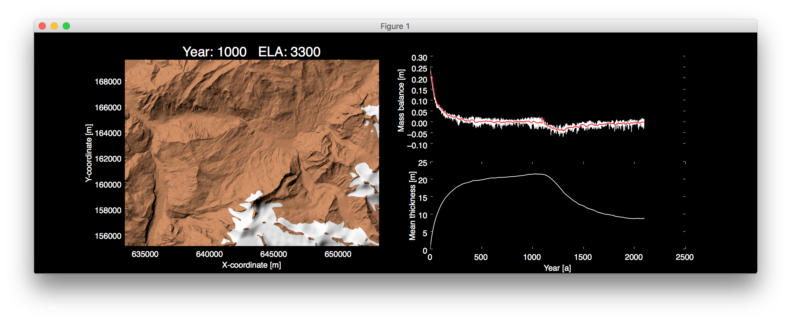
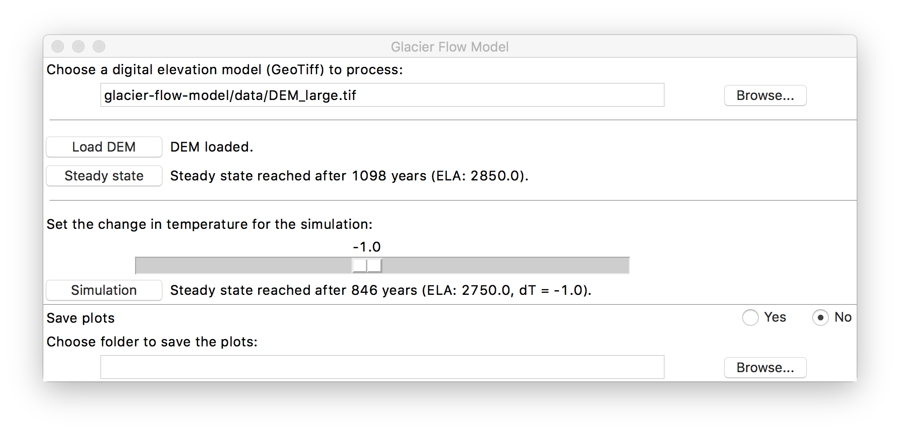
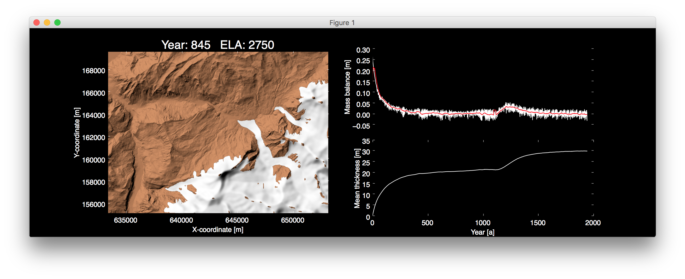

# Glacier Flow Model

Modelling glaciers flow, grounded on the glaciers mass balance and a digital elevation model (DEM).

The modelling is based on a linear relationship between altitude and mass balance, called the gradient. 
For alpine glaciers this gradient is around 0.006m/m. Continental glaciers are 
more around 0.003 and maritime glaciers 0.01m/m. The alpine gradient is set by default.
To model the glaciers flow, yearly steps are calculated. First the mass balance 
for the area is added to the glacial layer and in a next step to flow is simulated
by applying the D8 technique, which is well-known for modelling water flows over terrain.
To avoid pure convergence of the flow a random nudging of the flow is added. Afterwards
the surface is smoothed slightly and plotted to the screen. The simulation stops 
if the difference observed in the mass balance for a smoothed curve (n=-100) 
is below 0.0001m

## Installation

Download the GFM app and start it by double clicking (only tested under Mac OSX).

Alternatively:
1. Install python 2.7
2. Get the needed libraries: `pip install library-name`
3. Clone the project and open in PyCharm or any other python compatible IDE.

## Usage

To use the GlacierFlowModel, first a digital elevation model (DEM) in the GeoTiff
file format has to be specified. Keep the input file size small, otherwise 
the program may be slowed down remarkably. Then hit the `Load dem` button to open the DEM.

| | |
|---|---|

Afterwards the model needs to accumulate the initial ice mass with the mass 
balance parameters for the year 2000, which are set by default.
The first steady state of the model is calculated by hitting the `Steady state` button.

| | |
|---|---|

After reaching steady state a change in temperature can be simulated. Simply use 
the slider to choose the temperature change and press `Simulation`, 
to simulate the further development of the glaciers.

| | |
|---|---|

## Contributing

1. Fork it!
2. Create your feature branch: `git checkout -b my-new-feature`
3. Commit your changes: `git commit -am 'Add some feature'`
4. Push to the branch: `git push origin my-new-feature`
5. Submit a pull request :D

## Authors

* **Merlin Unterfinger** - *Initial work and app development* - [munterfinger](https://github.com/munterfinger)
* **Manuel Luck** - *Initial work*

## Built With

* [PyCharm](https://www.jetbrains.com) -  Integrated Development Environment (IDE), specifically for the Python language
* [Python 2.7](https://www.python.org) - Python is a high-level programming language for general-purpose programming
* [Gdal](http://www.gdal.org) - Geospatial Data Abstraction Library
* [Matplotlib](https://matplotlib.org) - Python plotting library
* [SciPy](https://www.scipy.org) - Python libraries for mathematics, science, and engineering
* [Tkinter](https://wiki.python.org/moin/TkInter) - Graphical User Interface (GUI) package

## License

This project is licensed under the MIT License - see the [LICENSE](LICENSE) file for details
